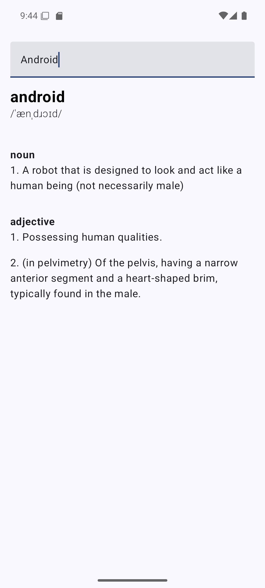
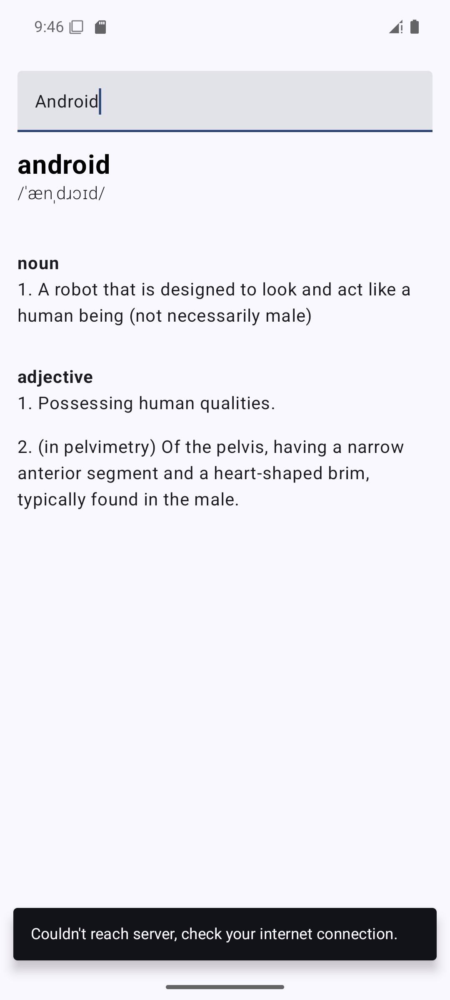

# Offline-Caching-With-Clean-Architecture
Fetch Data From Api and Store into Local Database(Room database)

## 🌳 Environment
Android Studio version used : ``Android Studio Ladybug | 2024.2.2 Patch 3``

## 🖼️ OutPut Screens

| Main Screen | Offline Caching | 
|-------------|-----------------|
|  |  | 
